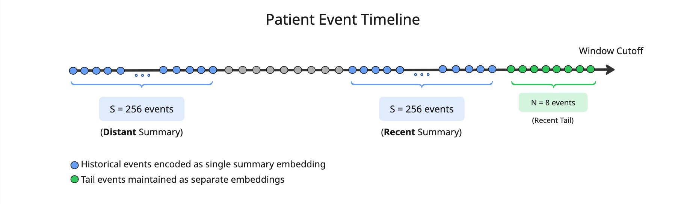
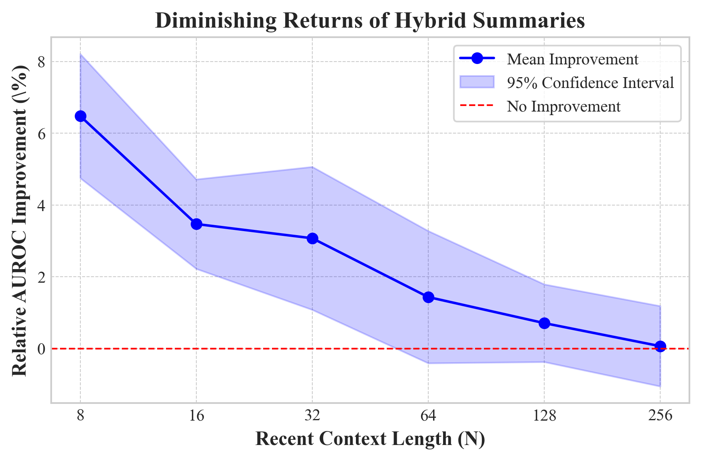

# Cached Foundation Model Summaries for Memory-Efficient Clinical Time Series Inference

Accepted at the **1st Time Series in the Age of Large Models (TSALM) Workshop, ICLR 2026**.

> Rafi Al Attrach, Rajna Fani, David Restrepo, Yugang Jia, Leo Anthony Celi, Peter Schüffler
> Massachusetts Institute of Technology | Technical University of Munich | CentraleSupelec

---

Transformer models for clinical time series face a deployment bottleneck: patient histories can span thousands of irregularly spaced events, but inference hardware imposes strict memory budgets. We study a decoupling strategy in which a pretrained foundation model compresses each patient's historical events into a fixed-size cached summary offline, and a lightweight model processes only a short recent window conditioned on that summary at inference time. Through 252 experiments on in-ICU mortality prediction (MIMIC-IV v3.1) we characterize when this is worthwhile. Cached summaries yield a 6.5% relative AUROC gain at N=8 recent events (p < 0.001), with a clear diminishing-returns pattern as N grows. FiLM modulation outperforms token injection (p < 0.001); recent-history summaries outperform distant-history summaries (p < 0.01).

<p align="center">
  
</p>

---

## Setup

Python 3.11 is required.

```bash
git clone https://github.com/rafiattrach/cached-summaries-ehr-inference.git
cd cached-summaries-ehr-inference
bash setup.sh
source venv/bin/activate
pip install meds-torch
```

Verify the installation:

```bash
python smoke_test.py
```

This runs three forward passes with random tensors (no MIMIC data required) and should print all three as PASS.

---

## Data preparation

MIMIC-IV requires credentialed access via [PhysioNet](https://physionet.org/content/mimiciv/). Convert the raw dataset to MEDS format using the [MIMIC-IV MEDS pipeline](https://github.com/Medical-Event-Data-Standard/MIMIC_IV_MEDS), then tensorize with meds-torch:

```bash
export MEDS_DIR=/path/to/mimic-iv/meds
export MODEL_DIR=/path/to/triplet_tensors
export MEDS_COHORT_DIR=/path/to/meds_cohort
export N_PARALLEL_WORKERS=8

meds-torch-ETL \
    pipeline_config_fp=experiments/configs/triplet_config.yaml \
    input_dir=$MEDS_DIR \
    output_dir=$MODEL_DIR \
    stage_runner_fp=experiments/configs/joblib_runner.yaml \
    hydra.launcher.n_jobs=$N_PARALLEL_WORKERS
```

---

## Reproducing experiments

The environment variables below are assumed to be set for all steps. Adjust paths to match your storage layout.

```bash
export MEDS_DIR=/path/to/mimic-iv/meds
export MODEL_DIR=/path/to/triplet_tensors
export MEDS_COHORT_DIR=/path/to/meds_cohort
export SUMMARY_CACHE_DIR=$MODEL_DIR/hybrid_summary_cache
export TASK_NAME=mortality/in_icu/first_24h
export GPU=0
```

**Step 1: extract task cohort**

```bash
aces-cli --multirun hydra/launcher=joblib \
    data=sharded data.standard=meds \
    data.root="$MEDS_DIR/data" \
    "data.shard=$(expand_shards $MEDS_DIR/data)" \
    cohort_dir="$MEDS_COHORT_DIR/tasks/" \
    cohort_name="$TASK_NAME" \
    config_path="experiments/configs/tasks/mortality/in_icu/first_24h.yaml"
```

**Step 2: precompute summary vectors (run once, reused across all training runs)**

```bash
bash scripts/precompute_summaries.sh \
    --data_dir $MODEL_DIR \
    --output_dir $SUMMARY_CACHE_DIR \
    --summary_size 256 \
    --variant recent \
    --gpu $GPU
```

**Step 3: train individual configurations**

```bash
bash scripts/run_experiment.sh -m baseline -n 64 -g $GPU \
    -r $(pwd) -o $MODEL_DIR/outputs

bash scripts/run_experiment.sh -m hybrid -a film -v recent -n 64 -s 256 -g $GPU \
    -r $(pwd) -o $MODEL_DIR/outputs

bash scripts/run_experiment.sh -m oracle -n 64 -s 256 -g $GPU \
    -r $(pwd) -o $MODEL_DIR/outputs
```

**Step 4: full grid search (reproduces all 252 runs)**

```bash
bash scripts/sweep_context_budget.sh \
    --gpu $GPU \
    --epochs 10 \
    --out_dir $MODEL_DIR/outputs/sweep \
    --repo_dir $(pwd)
```

**Ablations**

```bash
bash scripts/ablate_integration_method.sh \
    --gpu $GPU --out_dir $MODEL_DIR/outputs/ablation_integration

bash scripts/ablate_summary_source.sh \
    --gpu $GPU --out_dir $MODEL_DIR/outputs/ablation_source
```

---

## Key results

| Condition | AUROC gain vs baseline | p-value |
|-----------|----------------------:|---------|
| N=8,   FiLM, recent  | +6.5% | < 0.001 |
| N=32,  FiLM, recent  | +2.1% | < 0.001 |
| N=128, FiLM, recent  | +0.4% | n.s.    |
| N=256, FiLM, recent  | +0.1% | n.s.    |
| FiLM vs token (all N) | FiLM consistently better | < 0.001 |
| Recent vs distant summary | Recent consistently better | < 0.01 |

Memory at inference scales with N only, independent of total patient history length.

<p align="center">
  
</p>

---

## Citation

```bibtex
@misc{attrach2026cached,
  title     = {Cached Foundation Model Summaries for Memory-Efficient Clinical Time Series Inference},
  author    = {Al Attrach, Rafi and Fani, Rajna and Restrepo, David and Jia, Yugang
               and Celi, Leo Anthony and Sch\"{u}ffler, Peter},
  year      = {2026},
  note      = {1st ICLR Workshop on Time Series in the Age of Large Models}
}
```

---

## Dataset and acknowledgments

MIMIC-IV is available via [PhysioNet](https://physionet.org/content/mimiciv/) with credentialed access. This codebase extends the [meds-torch](https://github.com/Oufattole/meds-torch) framework.
